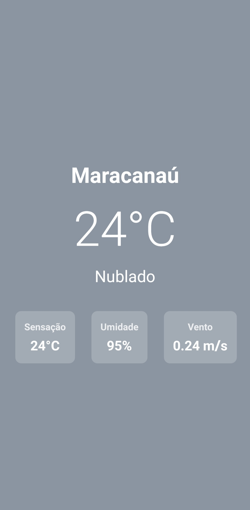

<div align="center">

# 🌤️ Climora — Weather Now

**Um app de previsão do tempo em tempo real para Android, construído com React Native + Expo. Detecta sua localização automaticamente e muda a cor do fundo conforme o clima.**



[](https://expo.dev/accounts/tuliovitor/projects/dev-app/builds)
[](https://reactnative.dev)
[](https://expo.dev)
[](https://openweathermap.org/api)

</div>

---

## 📌 Sobre o projeto

O **Climora** é um app de clima minimalista desenvolvido como primeiro projeto mobile do portfólio, usando React Native com Expo. O objetivo foi entender o ciclo completo de um app nativo: permissões de sistema, integração com API externa, build com EAS e distribuição de APK.

O app detecta automaticamente a localização do usuário via GPS, consulta a OpenWeather API e exibe temperatura, descrição do clima, sensação térmica, umidade e velocidade do vento — tudo com fundo que muda de cor conforme a condição climática atual. Projeto guiado pelo DevClub.

---

## 📱 Demonstração

> Este projeto é um app mobile nativo. Não há versão web — instale o APK no Android para testar.

| Nublado | Chuvoso | Céu aberto |
|---|---|---|
| Fundo cinza-azulado `#8B95A1` | Fundo azul-escuro `#4A7C8E` | Fundo azul-claro `#87CEEB` |


---

## ✨ Funcionalidades

- **Geolocalização automática** — solicita permissão e obtém as coordenadas GPS do dispositivo
- **Dados em tempo real** via OpenWeather API (temperatura, sensação, umidade, vento)
- **Fundo dinâmico** — a cor de fundo muda conforme o estado do céu (chuva, nuvens, sol)
- **Temperatura em °C** com arredondamento e localização em português do Brasil
- **Estado de carregamento** enquanto a localização e os dados são obtidos
- **Build para Android** com APK gerado via EAS Build

---

## 🧱 Stack

| Tecnologia | Uso |
|---|---|
| React Native | Framework principal para UI nativa |
| Expo SDK | Ambiente de desenvolvimento e build |
| EAS Build | Geração do APK para distribuição Android |
| expo-location | Permissão e leitura de coordenadas GPS |
| axios | Requisições HTTP para a OpenWeather API |
| OpenWeather API | Dados meteorológicos em tempo real |

---

## 🗂️ Estrutura do projeto

```
climora/
├── App.js          # Componente principal: lógica, estados e UI
├── index.js        # Entry point — registerRootComponent via Expo
├── app.json        # Configuração do app (nome, ícone, package Android)
├── eas.json        # Configuração de build (preview e production APK)
└── assets/
    ├── icon.png
    ├── splash-icon.png
    └── adaptive-icon.png
```

---

## 🧠 Decisões técnicas

### Fluxo de permissão antes de qualquer requisição

O app segue a ordem correta para apps com localização: primeiro pede permissão, depois acessa o GPS, depois chama a API. Se a permissão for negada, o app não quebra — apenas registra no console e para o fluxo:

```javascript
async function getLocation() {
  let { status } = await Location.requestForegroundPermissionsAsync();
  if (status !== 'granted') {
    console.log('Permission to access location was denied');
    return;
  }
  let location = await Location.getCurrentPositionAsync({});
  // ...chama a API só depois de ter as coordenadas
}
```

---

### Cor de fundo derivada do estado do clima

Em vez de usar imagens de fundo diferentes para cada condição, a cor é calculada diretamente a partir do campo `weather[0].main` retornado pela API, mantendo o bundle leve:

```javascript
const getBackgroundColor = () => {
  if (!weather) return '#6495ED';
  const main = weather.weather[0].main.toLowerCase();
  if (main.includes('rain'))  return '#4A7C8E';
  if (main.includes('cloud')) return '#8B95A1';
  if (main.includes('clear')) return '#87CEEB';
  return '#6495ED';
};
```

O `toLowerCase()` e o `includes()` garantem que variações como `"Light Rain"` ou `"Overcast Clouds"` sejam cobertas sem precisar mapear cada string exata.

---

### EAS Build configurado para APK direto

O `eas.json` configura o build de produção para gerar um `.apk` ao invés de `.aab`, facilitando a instalação direta no dispositivo sem passar pela Play Store:

```json
"production": {
  "android": {
    "buildType": "apk"
  },
  "autoIncrement": true
}
```

---

## 🚀 Como rodar localmente

```bash
# Clone o repositório
git clone https://github.com/tuliovitor/climora.git
cd climora

# Instale as dependências
npm install

# Inicie com Expo Go
npx expo start
```

Escaneie o QR Code com o app **Expo Go** no Android ou iOS para testar no dispositivo.

Para gerar o APK:

```bash
eas build --platform android --profile production
```

---

## 📈 Processo de desenvolvimento

| Etapa | O que foi feito |
|---|---|
| 01 | Setup do projeto com `create-expo-app` e configuração do EAS |
| 02 | Integração com `expo-location` e solicitação de permissão GPS |
| 03 | Integração com OpenWeather API via axios |
| 04 | Layout com `StyleSheet` — nome da cidade, temperatura e cards de info |
| 05 | Lógica de cor de fundo dinâmica por condição climática |
| 06 | Estado de carregamento e tratamento de permissão negada |
| 07 | Build e geração do APK com EAS Build |

---

## 💡 O que eu aprenderia diferente

- Teria guardado a API key em variável de ambiente desde o início, não direto no código — mesmo sendo um projeto de estudos, é um hábito importante de segurança
- Teria adicionado tratamento de erro na chamada da API (rede offline, cidade não encontrada) antes de publicar
- Teria explorado `ActivityIndicator` nativo do React Native no estado de carregamento, em vez de texto simples

---

## 👨‍💻 Autor

**TULIO VITOR**

[](https://linkedin.com/in/tuliovitor)
[](https://github.com/tuliovitor)

---

<div align="center">

Feito com muito ☕ e muito 🌧️

</div>
